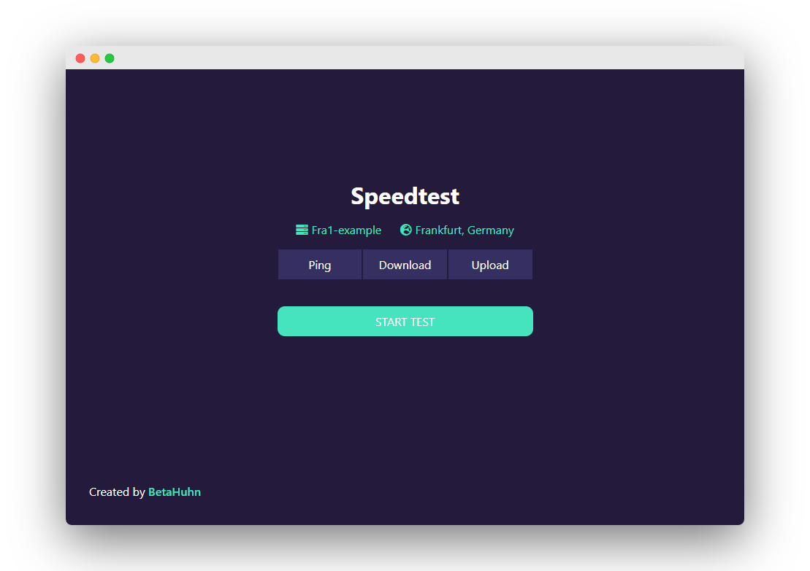

# Node.js Network Speedtest
> A simple Node.js powered speedtest website. Supports ping, upload and download speed


## Live Website

The live version of this project can be found here: https://speedtest.mxis.ch.

## Introduction

This repo contains the source code for a simple Node.js client speedtest. It uses WebSockets (w. [socket.io](https://www.npmjs.com/package/socket.io)) to quickly transfer data between the server and client. Ping is measured by timing multiple round trips and selecting the lowest one. Download and upload speeds are measured by repeatedly sending chunks of junk data back end forth and timing each request. The chunk size is calculated based on the current network speed.
> **Note:** The accuracy of tests decreases at higher speeds

## Setup

- Download this repo
```
git clone https://github.com/BetaHuhn/speedtest.git
```

- Change directory
```
cd speedtest
```

- Install dependencies
```
npm install
```

- Start server
```
npm run start
```

## To Do:

- [ ] Measure Jitter
- [ ] Display speedometer when performing test
- [ ] Different UI for showing result

## Authors
* **Maximilian Schiller** ([@BetaHuhn](https://github.com/BetaHuhn)) - *Initial work*

## License

This project is licensed under the MIT License - see the [LICENSE.md](LICENSE.md) file for details


